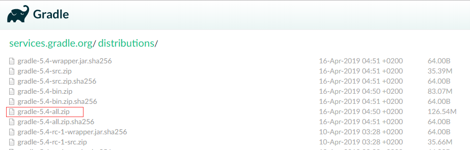

# 1. 概述

看 Spring 、 Spring MVC 、 Mybatis 源码有感而作，比起大牛写的 SSM 框架们，此框架被秒成渣渣，当然这是题外话。接触框架的时间差不多快一年了，记得当初学习反射用 invoke() 方法调用类的方法，来来回回看了三遍视屏，依然的感谢尚硅谷的佟刚老师，虽然没有给你们交过 Money 。如果当初没有被折磨过，可能现在也是一个只会用框架的人。

## 1.1 简介

首先，解释一下，这个项目由于只用了四天完成，有很多粗糙的地方，请大家见谅。如果想直接启动项目，请直接到第三步。

此项目是基于 Java 反射、CGLIB 动态代理、自定义注解、JDBC 写的一个轻量级一站式 WEB 框架，服务器是基于 NIO 集成的 Netty 内嵌的 http 服务器。

## 1.2 数据库交互模块 （ Mybatis )

只做了注解 @MyDelete 动态 Sql ； @MyInter、@MyUpdate、@MySelect 没有做动态 Sql 拼接，但是在 sql 参数全部不为空的情况下，正常执行是没有问题的，待完善。

### 1.3 IOC 与 DI （ Spring ）

IOC 未做循环依赖注入，所有 Bean 对象默认单例。普通 Bean 对象用@MyComponent、@MyService、@MyController 注解都行，**@MyMapper 注解**只能用于 Mapper 包的下注解且必须是接口，因为对 @MyMapper 注解的接口进行了动态代理，所以一定要十分注意。

对于接口对象的依赖注入，如果注入的接口有两个实现类，在使用@MyComponent、@MyService、@MyController 注解时，注入是必须添加别名或者去全类名，代码如下：

```java
/**
 * Service 接口
 */
public interface MyServices{
    
    /**
     *  说话
     */
    void say();
    
}

/**
 *  多实现接口必须添加别名
 */
@MyService("service1")
public class MyService1 implements  MyServices{
    
    
    @Override
    void say(){
        System.out.println("MyService One !");
    }
    
}

@MyService("service2")
public class MyService2 implements  MyServices{
    
    
    @Override
    void say(){
        System.out.println("MyService Two !");
    }
    
}

/**
 * 注入时必须添加别名
 */
@MyController
public class MyController {
    
   @MyResource("com.frame.xwz.service.impl.service1")
   public MyServices myServices;

   @MyAutowired
   @MyQualifier("service2")
   public MyServices getMyServices;
    
}
```  

## 1.4 Netty (Spring MVC)

以后在补充把，因为接触过这个框架的人不是很多，阿里巴巴的 Dubbo 底层就是基于 Netty 框架实现的 RPC 框架，惊不惊奇。

# 2. 缺点

写这个项目的时候，严重违反了设计模式中单一职责原则、接口隔离原则、开闭原则、依赖倒置原则、迪米特法则、里氏替换原则，所以这个项目目前来说无一好处。哈哈，我也很绝望，我看到这些准则实在第三天，复习设计模式的注意到的。准确来说，上面的提到的原则，没有一条遵守。五一放假后，回来在慢慢弄，预计六月份完结。

# 3. 启动

启动前，首先要做几件事情：

Lombok 插件的安装以及配置，哦。忘记很多童鞋没有用过 Gradle , 真的是十分尴尬。如果你没有用过 IntelliJ IDEA , 我也不清楚怎么拯救你。
 
## 3.1 Gradle 的配置

在[Gardel官网(http://services.gradle.org/distributions/)下载 Gradle 最新的 All.zip 包，解压到本地。



 