# 1. 概述

看 Spring 、 Spring MVC 、 Mybatis 源码有感而作，比起大牛写的 SSM 框架们，此框架被秒成渣渣，当然这是题外话。接触框架的时间差不多快一年了，记得当初学习反射用 invoke() 方法调用类的方法，来来回回看了三遍视屏，依然的感谢尚硅谷的佟刚老师，虽然没有给你们交过 Money 。如果当初没有被折磨过，可能现在也是一个只会用框架的人。

### 1.1 简介

首先，解释一下，这个项目由于只用了四天完成，有很多粗糙的地方，请大家见谅。如果想直接启动项目，请直接到第三步。

此项目是基于 Java 反射、CGLIB 动态代理、自定义注解、JDBC 写的一个轻量级一站式 WEB 框架，服务器是基于 NIO 集成的 Netty 内嵌的 http 服务器。至于为什么没有用线程相关的API,是因为现在不需要，如果有需要的话，可以多线程注册 Bean ，与处理清理。

### 1.2 数据库交互模块 （ Mybatis )

只做了注解 @MyDelete 动态 Sql ； @MyInter、@MyUpdate、@MySelect 没有做动态 Sql 拼接，但是在 sql 参数全部不为空的情况下，正常执行是没有问题的，待完善；仅涉及单边查询。

### 1.3 IOC 与 DI （ Spring ）

IOC 未做循环依赖注入，所有 Bean 对象默认单例。普通 Bean 对象用@MyComponent、@MyService、@MyController 注解都行，**@MyMapper 注解**只能用于 Mapper 包的下注解且必须是接口，因为对 @MyMapper 注解的接口进行了动态代理，所以一定要十分注意。

对于接口对象的依赖注入，如果注入的接口有两个实现类，在使用@MyComponent、@MyService、@MyController 注解时，注入是必须添加别名或者去全类名，代码如下：

```java
/**
 * Service 接口
 */
public interface MyServices{
    
    /**
     *  说话
     */
    void say();
    
}

/**
 *  多实现接口必须添加别名
 */
@MyService("service1")
public class MyService1 implements  MyServices{
    
    
    @Override
    void say(){
        System.out.println("MyService One !");
    }
    
}

@MyService("service2")
public class MyService2 implements  MyServices{
    
    
    @Override
    void say(){
        System.out.println("MyService Two !");
    }
    
}

/**
 * 注入时必须添加别名
 */
@MyController
public class MyController {
    
   @MyResource("com.frame.xwz.service.impl.service1")
   public MyServices myServices;

   @MyAutowired
   @MyQualifier("service2")
   public MyServices getMyServices;
    
}
```  

### 1.4 Netty (Spring MVC)

以后在补充把，因为接触过这个框架的人不是很多，阿里巴巴的 Dubbo 底层就是基于 Netty 框架实现的 RPC 框架，惊不惊奇。

# 2. 缺点

写这个项目的时候，严重违反了设计模式中单一职责原则、接口隔离原则、开闭原则、依赖倒置原则、迪米特法则、里氏替换原则，所以这个项目目前来说无一好处。哈哈，我也很绝望，我看到这些准则实在第三天，复习设计模式的注意到的。准确来说，上面的提到的原则，没有一条遵守。五一放假后，回来在慢慢弄，预计六月份完结。

异常处理，后台异常处理，暂时未往前端抛，以后有机会再说。

# 3. 启动

启动前，首先要做几件事情：

Lombok 插件的安装以及配置，哦。忘记很多童鞋没有用过 Gradle , 真的是十分尴尬。如果你没有用过 IntelliJ IDEA , 我也不清楚怎么拯救你。
 
## 3.1 Gradle 的配置

在[Gardel官网](http://services.gradle.org/distributions/)下载 Gradle 最新的 All.zip 包，解压到本地。


然后通过 Idea 检出项目

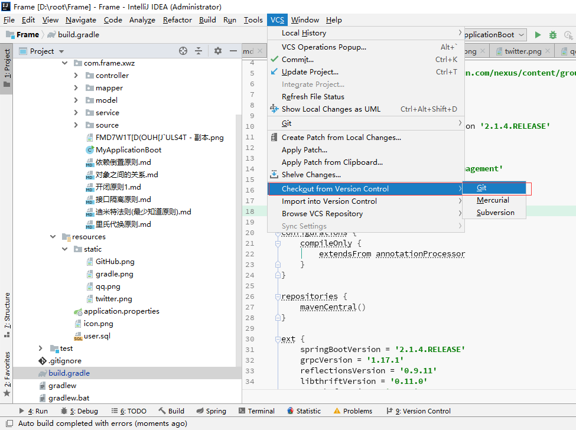

Gradel 配置，gradle 文件选择 User local gradle distribution , 远程下载特别慢

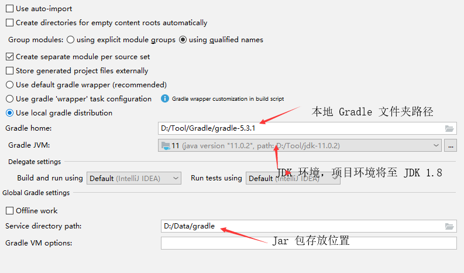

配置号以后会自动导入依赖，如果导入依赖失败，刷新再次导入。

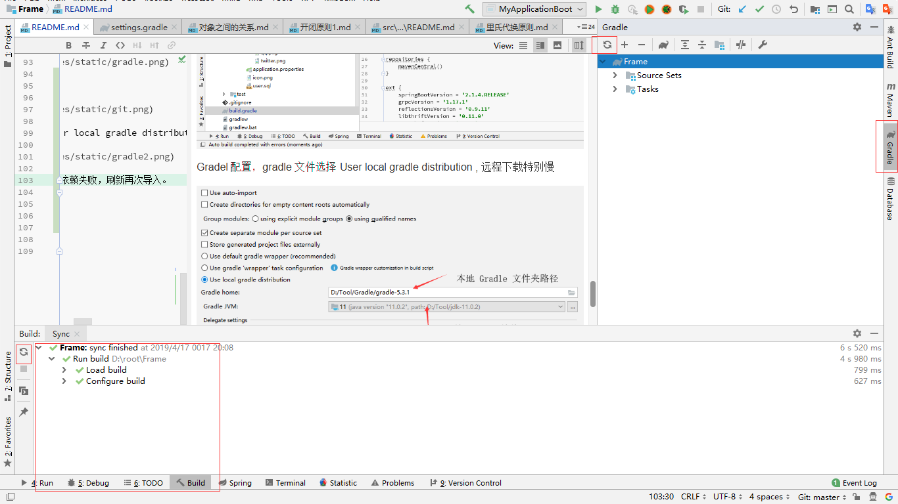

## 3.2 成功后，下载 Lombok 插件，并编译注解

下载 Lombok 插件

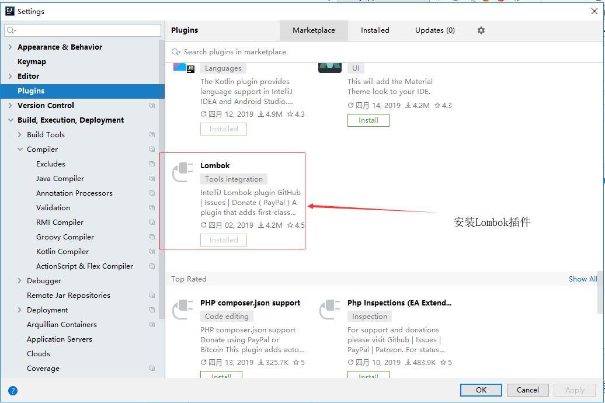

Lombok 插件设置

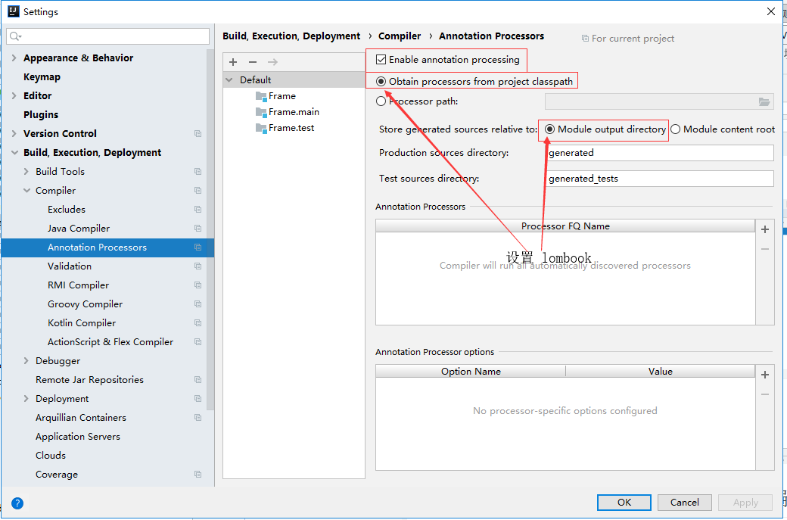

Java 文件编译设置，反射获取 Method 参数名

 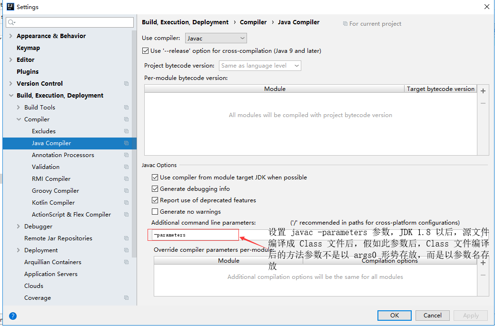
 
未加 -parameters 参数反射获取不到方法参数名，其完整命令 javac -parameters

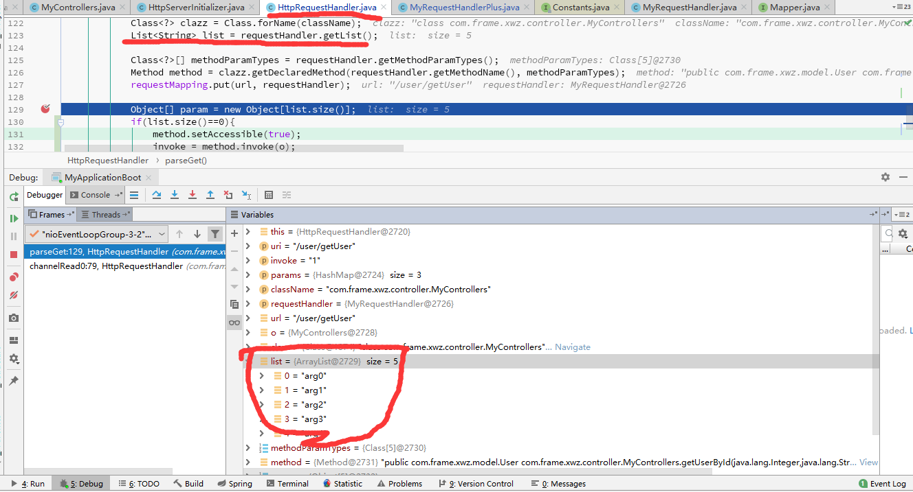

加了以后

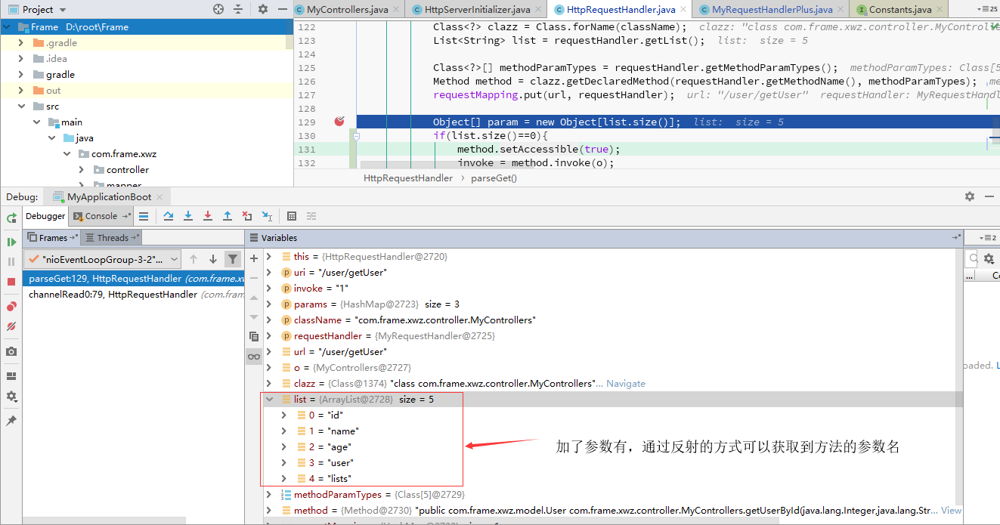

参数名注入的代码位置

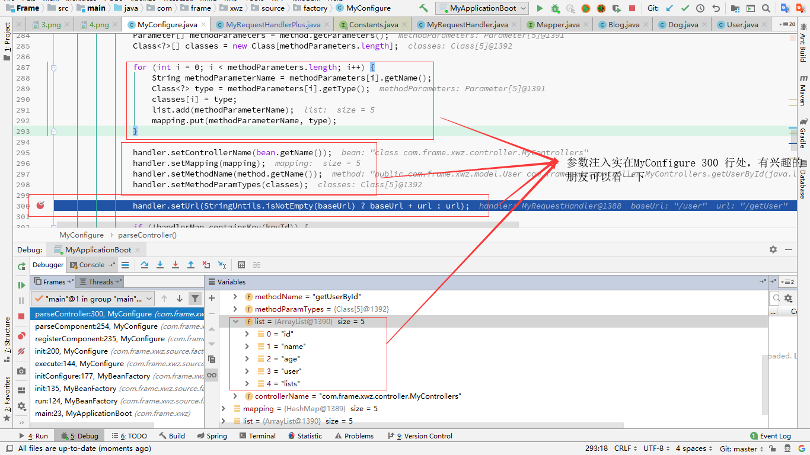

## 3.3 数据库相关设置

水平有限，数据库连接错，它居然不报错。

回到整体，把 Resources 目录下的 sql 文件插入数据库，然后配置 application.properties 文件。

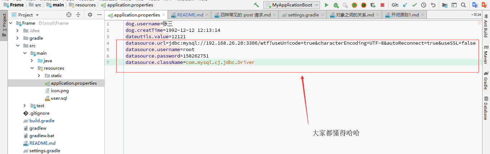

## 3.4 启动

Netty 的日志打印好烦，试着解决了一下，发现日志打印的级别依然没有改变。但是只要有 server start up on port: 8081 启动好，就能正常方法访问

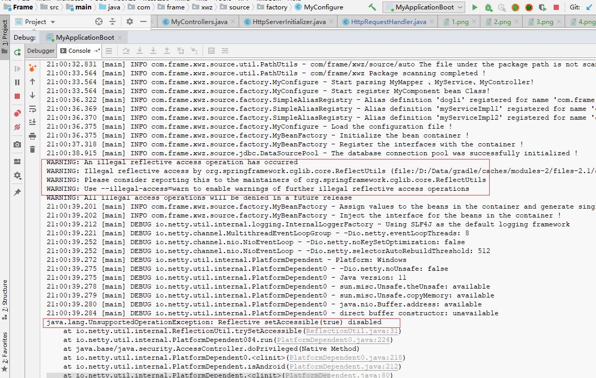


如之下的例子：

Post 请求的例子在MyFrame.postman_collection.json中，打开 Postman 导入 Js 即可

其结果如下，参数处理了十几种，在com.frame.xwz.source.exception.JavaType 中

### post 请求

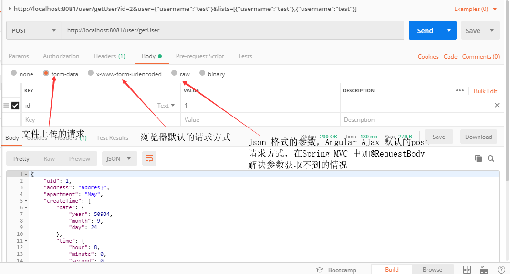

### get 请求
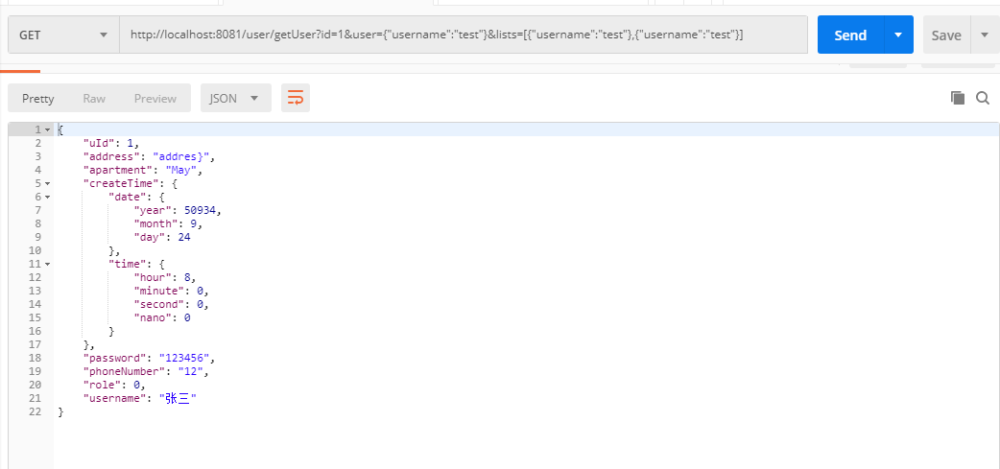

### 空参请求

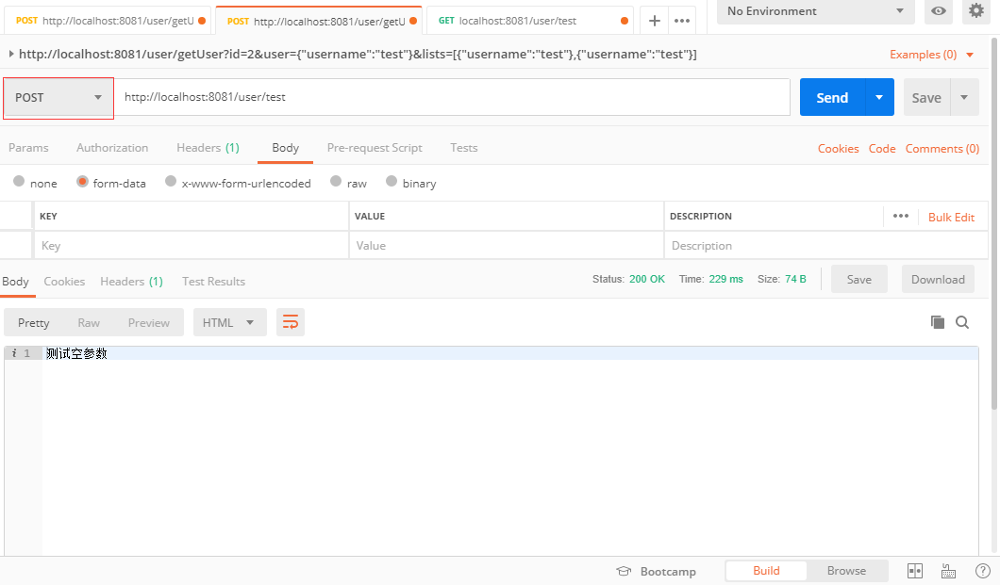

附代码

```java
package com.frame.xwz.source.exception;

/**
 * @author xuweizhi
 * @date 2019/04/15 15:46
 */
public interface JavaType {

    String STRING = "java.lang.String";

    String CHARACTER = "java.lang.Character";

    String DATE = "java.util.Date";

    String INTEGER = "java.lang.Integer";

    String FLOAT = "java.lang.Float";

    String DOUBLE = "java.lang.Double";

    String LONG = "java.lang.Long";

    String BYTE = "java.lang.Byte";

    String SHORT = "java.lang.Short";

    String BOOLEAN = "java.lang.Boolean";

    String LOCAL_DATE_TIME = "java.time.LocalDateTime";
}

```

请求参数转换做得有些滑稽，应该用map存放，用一个专门的对象进行参数转化 key = methodPramType.class value 对应的转换实体，因为这个实体还可以做数据库到Mybatis的转换
这里只做了List 集合的转换，时间格式默默认为 yyyy:MM:dd HH:mm:ss ，通过 DateUtils.format = yyyy 设置。

package com.frame.xwz.source.http.MyRequestHandlerPlu

```java
package com.frame.xwz.source.http;

public class MyRequestHandlerPlus {
    
     public Object getValue(Class<?> clazz, Object obj, boolean flag) throws NoSuchMethodException, IllegalAccessException, InvocationTargetException, InstantiationException {
            switch (clazz.getName()) {
                case INTEGER:
                    obj = flag ? Integer.valueOf((String) obj) : Integer.valueOf("0");
                    break;
                case STRING:
                    obj = flag ? (String) obj : (String) null;
                    break;
                case DATE:
                    if (flag) {
                        obj = DateUtils.getDate((String) obj);
                    } else {
                        obj = (Date) null;
                    }
                    break;
                case LOCAL_DATE_TIME:
                    if (flag) {
                        obj = DateUtils.getLocalDateTime(DateUtils.getDate((String) obj));
                    } else {
                        obj = (LocalDateTime) null;
                    }
                    break;
                case SHORT:
                    obj = flag ? Short.valueOf((String) obj) : (Short) null;
                    break;
                case LONG:
                    obj = flag ? Long.valueOf((String) obj) : (Long) null;
                    break;
                case FLOAT:
                    obj = flag ? Float.valueOf((String) obj) : (Float) null;
                    break;
                case DOUBLE:
                    obj = flag ? Double.valueOf((String) obj) : (Double) null;
                    break;
                case BYTE:
                    obj = flag ? Byte.valueOf((String) obj) : (Byte) null;
                    break;
                case BOOLEAN:
                    obj = flag ? Boolean.valueOf((String) obj) : FALSE;
                    break;
                default:
                    if (clazz.getName().contains("List")) {
                        obj = GsonUtil.parseJsonArrayWithGson((String) obj, clazz);
                    } else {
                        obj = GsonUtil.parseJsonWithGson((String) obj, clazz);
                    }
            }
            return obj;
        }

}


```
# 4. 收获

IOC 与 DI 是我写地最难受的地方，DI 需要进行对原始状态的 Bean 进行暴露，递归调用方法，不然一直注入不了参数值（配置文件中的参数值）。虽然没有按照 Spring 的三级缓存策略来进行 Bean 加载， 但是也用了中间变量对值进行预处理。

第二个难点就是 JDBC JavaType 与 DataType 之间的数据转换， 本人用的 Switch 进行类型判断，互相转换值。但是只有Delect 操作做了动态Sql拼接，其他sql操作未做确实是一个遗憾。

第三个难点是 对 Netty 复习，学了大半年用一次第一些生疏，请求参数与绑定那一块，Post 请求的 application/json 还未完成。

最后的最后，应该先复习一下设计模式的内容，其规范了很多设计标准简化框架的开发与后期维护，实现的过程中也可能减少很多时间。

**千万不要在最能吃苦的年纪选择安逸，与君共勉。**

# 5. 彩蛋

用浏览器请求，右上角的角标是是什么呢？？

哈哈哈 

如果删除 resources 目录下的 icon.png 又会怎么样呢？

其实有很多隐藏的彩蛋，等待各位的发现！
